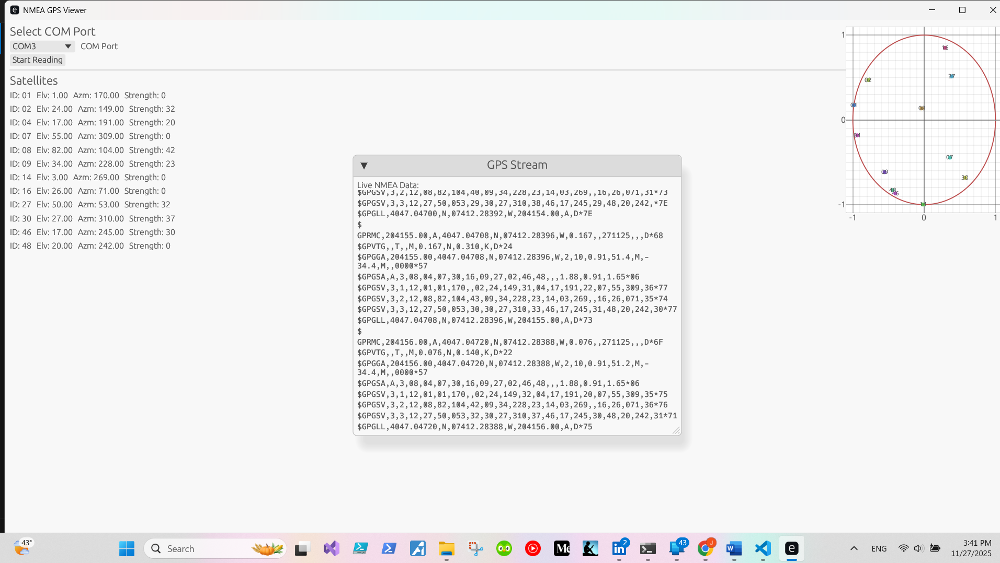

# Rust GPS GUI COM Port Reader

Using Rust and the following packages

```Rust
[dependencies]
eframe = { version = "0.27", features = ["wgpu", "persistence"] }
egui = "0.27"
egui_plot = "0.27"
serialport = "4.2"
nmea = "0.6"
```

I was able to open the U-Blox port on my GPS dongle and parse the longitude and latitude, printing the information in the streaming output for the user to see.
Also showing the Satellites its fixed to, and the satellites its attached to in the circle.

## Sample Terminal Output



## Acknowledgements

 - Professors at Kean University
 - Professors at NJIT
 - Research Mentors at Kean University
 - StackOverflow Q&A Discussion
 - ChatGPT
 - ClaudeAI


## Authors

- [@FPyC639](https://github.com/FPyC639)


## Appendix

[](https://www.buymeacoffee.com/joseserra8x)
